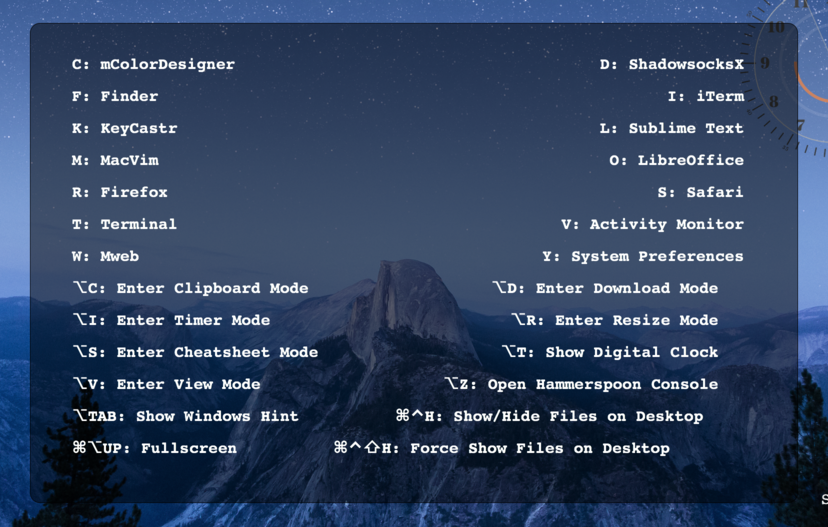
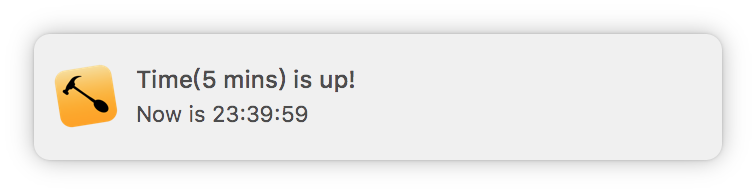
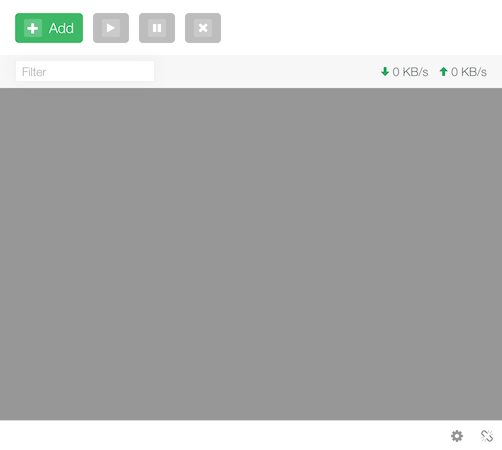
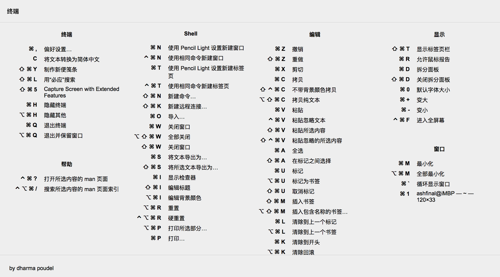
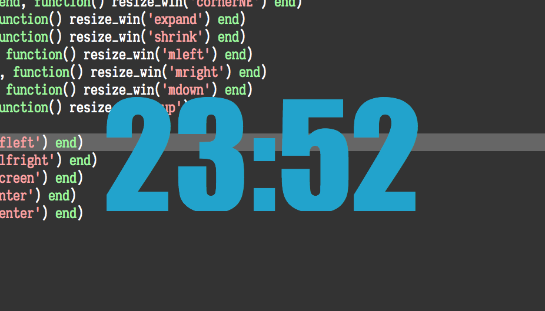
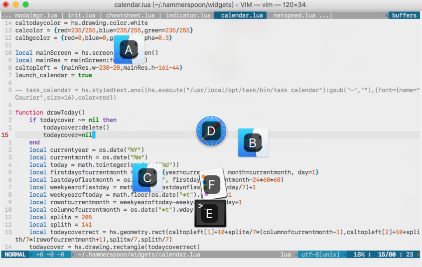
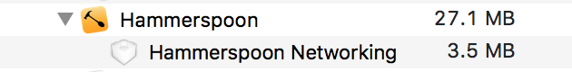

# Awesome-hammerspoon, as advertised.

Awesome-hammerspoon is my collection of lua scripts for [Hammerspoon](http://www.hammerspoon.org/). It has highly modal-based, vim-styled key bindings, provides some functionality like desktop widgets, window management, application launcher, cheatsheets... etc.

> Hammerspoon is a tool for powerful automation of OS X. You can write Lua code that interacts with OS X APIs for applications, windows, mouse pointers, filesystem objects, audio devices, batteries, screens, low-level keyboard/mouse events, clipboards, location services, wifi, and more.<sup>[1](http://www.hammerspoon.org/)</sup>

*Out of the box, Hammerspoon does nothing. You will need Lua scripts in `~/.hammerspoon/` to do your work. Here is this repository come to help.*

## Get started

1. Install [Hammerspoon](http://www.hammerspoon.org/) first.
2. `git clone https://github.com/ashfinal/awesome-hammerspoon.git ~/.hammerspoon`
3. Reload the configutation.

and you're set.

## What's modal-based key bindings?

Well... simply to say, it allows you using <kbd>S</kbd> key to resize windows in `resize` mode, but in `app` mode, to launch Safari, in `timer` mode, to set a 10-mins timer... something like that. During all progress, you don't have to press extra keys.


And this means a lot.

- It's scene-wise, you can use same key bindings to do different jobs in different scenes. You don't worry to run out of your hotkey bindings, and twist your fingers to press <kbd>⌘</kbd> + <kbd>⌃</kbd> + <kbd>⌥</kbd> + <kbd>⇧</kbd> + <kbd>C</kbd> in the end.
- Less keystrokes, less memory pressure. You can press <kbd>⌥</kbd> + <kbd>A</kbd> to enter `app` mode, release, then press single key <kbd>S</kbd> to launch Safari, or <kbd>C</kbd> to lauch Chrome. Sounds good? You keep your pace, no rush.
- Easy to extend, you can create your own modals if you like. For example, `Finder` mode, in which you press <kbd>T</kbd> to open Terminal here, press <kbd>S</kbd> to send files to predefined path, press <kbd>C</kbd> to upload images to cloud storage.

**NOTICE:** After your work you'd better quit current mode back to normal. Or, you carefully pick your key bindings to avoid conflict with other hotkeys.

## How to use?

So, following above procedures, you have reloaded Hammerspoon's configutation. Let's see what we've got here.

**UPDATE:** Now you can press <kbd>⇥</kbd> to show key bindings, available in `resize`, `app`, `view`, `timer` mode.



### Desktop widgets

As you may have noticed, there are two clean, nice-looking desktop widgets, analogclock and calendar. Usually we don't interact with them, but I do hope you like them.


### Mode block

There is also a small gray block in the bottom right corner, maybe displaying current netspeed. Well, it's actually **mode block**. Want to know in which mode you are? Give it a glance. When Hammerspoon starts, or there's no work to do, it shows `DOCK MODE` in black background. But alway displaying the black block is a little boring, so we use it for netspeed monitor if there's no activity for 5 secs.

**Mode block** holds the entrance to other modes, you can use <kbd>⌥</kbd> + <kbd>space</kbd> to toggle its display. Then use <kbd>⌥</kbd> + <kbd>R</kbd> to enter `resize` mode, or use <kbd>⌥</kbd> + <kbd>A</kbd> to enter `app` mode... etc.

Key bindings available:

| Key bindings | Movement |
| --- | :-- |
| <kbd>⌥</kbd> + <kbd>A</kbd> | Enter app mode |
| <kbd>⌥</kbd> + <kbd>C</kbd> | Enter `clipboard` mode |
| <kbd>⌥</kbd> + <kbd>D</kbd> | Enter `download` mode |
| <kbd>⌥</kbd> + <kbd>I</kbd> | Enter `timer` mode |
| <kbd>⌥</kbd> + <kbd>R</kbd> | Enter `resize` mode |
| <kbd>⌥</kbd> + <kbd>S</kbd> | Enter `cheatsheet` mode |
| <kbd>⌥</kbd> + <kbd>T</kbd> | Show current time |
| <kbd>⌥</kbd> + <kbd>v</kbd> | Enter `view` mode |
| <kbd>⌥</kbd> + <kbd>Z</kbd> | Open Hammerspoon console |
| <kbd>⌥</kbd> + <kbd>⇥</kbd> | Show window hints |

*In most modes, you can use <kbd>⌥</kbd> + <kbd>key</kbd>, <kbd>Q</kbd>, or <kbd>⎋</kbd> to quit back to DOCK mode("key" is the same as you enter modes). And switch from one mode to another directly.*

### Window management(resize mode)

Use <kbd>H</kbd>, <kbd>L</kbd>, <kbd>J</kbd>, <kbd>K</kbd> to **resize** windows.

Use <kbd>=</kbd>, <kbd>-</kbd> to expand/shrink the window size.

Use <kbd>⌘</kbd> + <kbd>H/L/J/K</kbd> to cycle through active windows.

Use <kbd>⇧</kbd> + <kbd>H/L/J/K</kbd> to **move** windows around.

Use <kbd>⌃</kbd> + <kbd>H/L/J/K</kbd> to resize windows to 1/2 of screen.

Use <kbd>⌃</kbd> + <kbd>Y/U/I/O</kbd> to resize windows to 1/4 of screen.

Use <kbd>F</kbd> to put windows to fullscreen, use <kbd>C</kbd> to put windows to center of screen, use <kbd>⌃</kbd> + <kbd>C</kbd> to resize windows to predefined size and center them.

And of course, you can use system-wide <kbd>⌘</kbd> + <kbd>⇥</kbd> to switch between active applications.

### App launcher(app mode)

Use <kbd>F</kbd> to launch Finder or focus the existing window; <kbd>S</kbd> for Safari; <kbd>T</kbd> for Terminal; <kbd>V</kbd> for Activity Monitor; <kbd>Y</kbd> for System Preferences... etc.

If you want to define your own hotkeys, please create `~/.hammerspoon/private/awesomeconfig.lua` file, then add something like below:

``` lua
applist = {
    {shortcut = 'i',appname = 'iTerm'},
    {shortcut = 'l',appname = 'Sublime Text'},
    {shortcut = 'm',appname = 'MacVim'},
    {shortcut = 'o',appname = 'LibreOffice'},
    {shortcut = 'r',appname = 'Firefox'},
}

```

### Timer indicator(timer mode)

Have you noticed this issue on macos? There is 5 pixel tall blank at the bottom of the screen for non-native fullscreen window, which is sometimes disturbing. Let's make the blank more useful. When you set a timer, this will draw a colored line to fill that blank, meanwhile, show progress of the timer.



Press <kbd>0</kbd> to set a 5-mins timer, <kbd>↩︎</kbd> to set a 25-mins timer.

Press <kbd>1</kbd> to set a 10-mins timer;

Press <kbd>2</kbd> to set a 20-mins timer;

...

Press <kbd>9</kbd> to set a 90-mins timer.

### Clipboard show(clipboard mode)

It shows the content of your clipboard. If text or image type then display it with proper size, if hyperlink type then use default browser to open it. Click the display block it will destory itself.

I usually use this to display QR image for cellphone's faster scanning, or display some text for better reading.

Below is what happened when I press <kbd>⌘</kbd> + <kbd>C</kbd> to copy `Hammerspoon.app`, then press <kbd>⌥</kbd> + <kbd>C</kbd> to activate clipboard mode.


### Aria2 frontend(download mode)

I use [glutton](https://github.com/NemoAlex/glutton)(a tiny webclient for aria2) to manage aria2's download queue. This mode creates an interface for glutton, so I can handle aria2 more convenient.



*To speed up the display of webclient, by default when you press `⎋` the interface is hiden(instead destroyed). This may increase resource occupation. If you don't use `download` mode for a long time, when quitting use <kbd>⌃</kbd> + <kbd>⎋</kbd> to completely destory the webclient.*

### Cheatsheet(cheatsheet mode)

It shows the cheatsheet of current application's hotkeys. Code comes from [here](https://github.com/dharmapoudel/hammerspoon-config).

Let the picture talk:



### Other stuff

- **Tmux-styled Clock** <kbd>⌥</kbd> + <kbd>T</kbd>

Works even when you're watching video in fullscreen.



- **Windows Hint** <kbd>⌥</kbd> + <kbd>⇥</kbd>

Focus to your windows easier.



- **`View` Mode** <kbd>⌥</kbd> + <kbd>V</kbd>

Use <kbd>K/J/H/L</kbd> to scroll around.

Use <kbd>⌃</kbd>/<kbd>⇧</kbd> + <kbd>K/J/H/L</kbd> to move mouse around.

Use <kbd>,</kbd>/<kbd>.</kbd> for mouse left/right click.

- **Hide Desktop** <kbd>⌘</kbd> + <kbd>⌃</kbd> + <kbd>H</kbd>

Hide your desktop files temporarily to avoid embarrass on some occasion.

Use <kbd>⌘</kbd> + <kbd>⌃</kbd> + <kbd>⇧</kbd> + <kbd>H</kbd> to force show all hiden files.

- **Lock Screen** <kbd>⌘</kbd> + <kbd>⌃</kbd> + <kbd>⇧</kbd> + <kbd>L</kbd>

-------

For whatever mode, you can always use:

<kbd>⌘</kbd> + <kbd>⌥</kbd> + <kbd>⇠</kbd> to resize windows to left-half of screen

<kbd>⌘</kbd>  + <kbd>⌥</kbd> + <kbd>⇢</kbd> to resize windows to right-half of screen

<kbd>⌘</kbd>  + <kbd>⌥</kbd> +  <kbd>⇡</kbd> to resize windows to fullscreen

<kbd>⌘</kbd>  + <kbd>⌥</kbd> +  <kbd>⇣</kbd> to put windows to predefined size

<kbd>⌘</kbd>  + <kbd>⌥</kbd> +  <kbd>↩︎</kbd> to put windows to center of screen

-------

For those who care about system resource:



## Customization

Modify the file `~/.hammerspoon/private/awesomeconfig.lua`, you should create it before doing that.

1. Add application launching hotkey

    See the section `App launcher(app mode)` above.

2. Add/Remove the plugin modules

    default modules:

    ``` lua
    module_list = {
        "basicmode",
        "widgets/netspeed",
        "widgets/calendar",
        "widgets/analogclock",
        "modes/indicator",
        "modes/clipshow",
        "modes/aria2",
        "modes/cheatsheet",
    }
    ```

    For example, remove `aria2` module(`Download` mode), add your own module `mymodule`:

    ``` lua
    module_list = {
        "basicmode",
        "widgets/netspeed",
        "widgets/calendar",
        "widgets/analogclock",
        "modes/indicator",
        "modes/clipshow",
        "modes/cheatsheet",
        "private/mymodule",
    }
    ```

3. Create your own modal key bindings

    See http://www.hammerspoon.org/docs/hs.hotkey.modal.html, also you can refer to my scripts.

## TODO

- [X] Code cleanup. Make modules can be easily pluged or unpluged.

    Done. It should work now, also some global options can be set by using `~/.hammerspoon/private/awesomeconfig.lua` file.

- [ ] Put mode block into menubar? As I usually hide menubar, this will be a better idea? Or just provide an option?

- [X] Help system for modes. Press <kbd>?</kbd> to show hotkeys, so I don't have to list them all in this file.

    Done. use <kbd>⇥</kbd> for showing hotkeys, and key bindings can update themself dynamically.

- [ ] Safari tabs/history search

- [ ] Make opening URL works for ordinary string in `clipboard` mode

## Thanks to

http://www.hammerspoon.org/

https://github.com/zzamboni/oh-my-hammerspoon

https://github.com/scottcs/dot_hammerspoon

https://github.com/dharmapoudel/hammerspoon-config

http://tracesof.net/uebersicht/

## Welcome to

Share your scripts and thoughts.

: )
